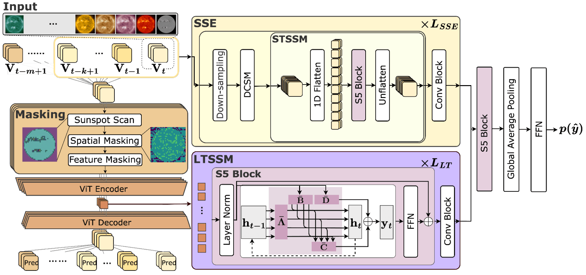
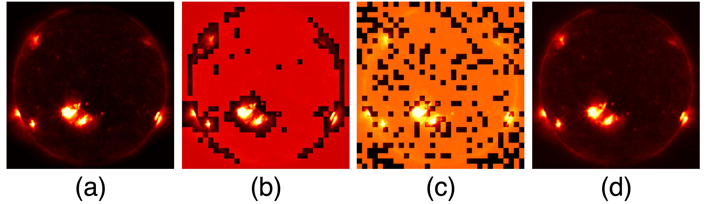
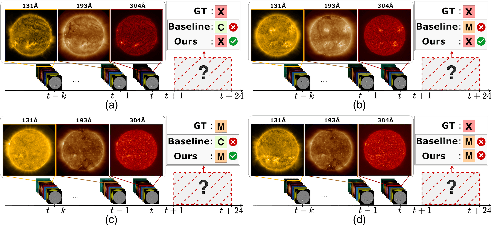

# [ICCV 25] Deep Space Weather Model: Long-Range Solar Flare Prediction from Multi-Wavelength Images 🛰️

[](https://iccv.thecvf.com/)
[]()
[](https://iccv25-6qrol.kinsta.page)
[]()
[](https://huggingface.co/datasets/sh237/FlareBench)

PyTorch training code for **Deep Space Weather Model (Deep SWM)** - accurately and reliably predicts solar flares by capturing long-range spatio-temporal dependencies and fine-grained features in multi-channel solar image series.

<p align="center">
  
</p>

## 📖 Abstract
<details>
  <summary><font size="+1">Click to expand</font></summary>
  <br>
  Accurate, reliable solar flare prediction is crucial for mitigating potential disruptions to critical infrastructure, while predicting solar flares remains a significant challenge. Existing methods based on heuristic physical features often lack representation learning from solar images. On the other hand, end-to-end learning approaches struggle to model long-range temporal dependencies in solar images.

In this study, we propose **Deep Space Weather Model (Deep SWM)**, which is based on multiple deep state space models for handling both ten-channel solar images and long-range spatio-temporal dependencies. Deep SWM also features a **sparse masked autoencoder**, a novel pretraining strategy that employs a two-phase masking approach to preserve crucial regions such as sunspots while compressing spatial information. Furthermore, we built **FlareBench**, a new public benchmark for solar flare prediction covering a full **11-year solar activity cycle**, to validate our method. Our method **outperformed baseline methods** and even **human expert performance** on standard metrics in terms of performance and reliability.
</details>

---

## ✨ Key Features

- **Solar Spatial Encoder (SSE)**: Captures spatio-temporal features by selectively weighting image channels and modeling dependencies across space and time.
- **Long-range Temporal SSM (LT-SSM)**: Extends deep state-space models to capture temporal patterns exceeding the solar rotation period.
- **Sparse MAE**: A tailored pretraining strategy for solar images that preserves critical but sparse regions (like sunspots) using a novel two-phase masking approach.
- **FlareBench Dataset**: A new public benchmark covering a complete 11-year solar cycle for robust and unbiased evaluation.

<p align="center">
  
  <em><br>Deep SWM Architecture: Solar Spatial Encoder (SSE) and Long-range Temporal SSM (LT-SSM)</em>
</p>

<p align="center">
  
  <em><br>Our Sparse MAE pre-training preserves critical sunspot regions better than standard methods.</em>
</p>

---

## 🏆 Results

Our model demonstrates state-of-the-art performance, outperforming existing methods and even human experts on the comprehensive FlareBench dataset.

<details>
  <summary><font size="+1">Quantitative Comparison</font></summary>
  <br>
  Our method achieves the highest scores across all standard evaluation metrics.
  <br>

| Method                            | Test Period                          | GMGS↑             | BSS<sub>≥M</sub>↑      | TSS<sub>≥M</sub>↑      |
| --------------------------------- | ------------------------------------ | ----------------- | -------------------- | ----------------- |
| Flare Transformer (w/o PF)   | 2014-2017 (4 years)                  | 0.220±0.116       | -1.770±0.225         | 0.198±0.371       |
| DeFN-R                       | 2014-2015 (2 years)                  | 0.302±0.055       | 0.036±0.982          | 0.279±0.162       |
| CNN-LSTM                          | 2019-12-01 - 2022-11-30 (3 years)    | 0.315±0.166       | 0.272±0.259          | 0.330±0.306       |
| DeFN                         | 2014-2015 (2 years)                  | 0.375±0.141       | 0.022±0.782          | 0.413±0.150       |
| Flare Transformer (full)     | 2014-2017 (4 years)                  | 0.503±0.059       | 0.082±0.974          | 0.530±0.112       |
| **Ours** | **2019-12-01 - 2022-11-30 (3 years)**| **0.582±0.032** | **0.334±0.299** | **0.543±0.074** |
| *Experts [38, 49]* | *2000-2015 (16 years)* | *0.48* | *0.16* | *0.50* |

</details>
<br>
<details>
  <summary><font size="+1">Qualitative Examples</font></summary>
  <br>
  Deep SWM successfully predicts high-impact X-class flares where baseline models fail.
  <p align="center">
    
  </p>
  <em>Qualitative results showing successful predictions of X-class and M-class solar flares.</em>
</details>

---

## 🛠️ Getting Started

### Installation

Clone the repository and set up the environment:

```bash
# Clone the repository
git clone https://github.com/username/DeepSWM.git
cd DeepSWM

# (Optional) Create and activate a conda environment
conda create -n deepswm python=3.9
conda activate deepswm

# Install dependencies
pip install -r requirements.txt
```

### Usage

## 📊 Data Preparation

Download the FlareBench dataset from [Hugging Face](https://huggingface.co/datasets/sh237/FlareBench):

```bash
# Install huggingface_hub if not already installed
pip install huggingface_hub
```

```python
# Download the dataset using Python
from huggingface_hub import snapshot_download
snapshot_download(repo_id="sh237/FlareBench", repo_type="dataset", local_dir="./flarebench_dataset")
```

Or use the command line:

```bash
huggingface-cli download sh237/FlareBench --repo-type dataset --local-dir ./flarebench_dataset
```

Convert the dataset to h5 format using the provided script:

```bash
python datasets/main/create_datasets.py
```

## 🚀 Pre-training

Run the pre-training process to learn representations from the magnetogram images:

```bash
python pretrain.py --input_dir ./flarebench_dataset/all_data_hours \
                  --output_dir ./flarebench_dataset/all_features \
                  --mode train \
                  --data_root ./flarebench_dataset
```

## 🔍 Feature Extraction

Extract intermediate features from the pre-trained model:

```bash
python pretrain.py --input_dir ./flarebench_dataset/all_data_hours \
                  --output_dir ./flarebench_dataset/all_features \
                  --mode inference_all \
                  --data_root ./flarebench_dataset
```

Organize the extracted features by sample:

```bash
python datasets/main/create_history_features.py
```

## 🎯 Training

Train the model using the extracted features:

```bash
python main.py --params params/main/params.yaml \
              --imbalance \
              --fold 3 \
              --data_root ./flarebench_dataset \
              --cuda_device 0

```

## 📝 Citation

If you find our work helpful, please consider citing the following paper and/or ⭐ the repo:

```bibtex
@inproceedings{nagashima2025deepswm,
  title={Deep Space Weather Model: Long-Range Solar Flare Prediction from Multi-Wavelength Images},
  author={Shunya Nagashima and Komei Sugiura},
  booktitle={Proceedings of the IEEE/CVF International Conference on Computer Vision},
  year={2025}
}
```

## 📄 License

This work is licensed under the BSD-3-Clause-Clear License. To view a copy of this license, see [LICENSE](LICENSE).
