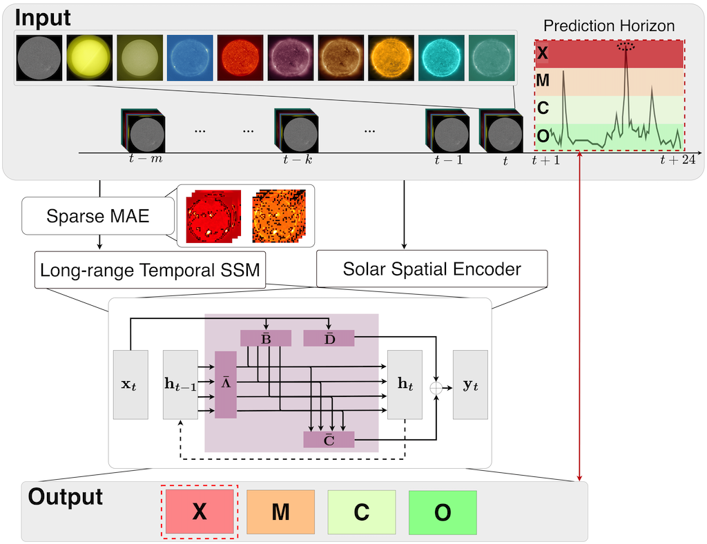
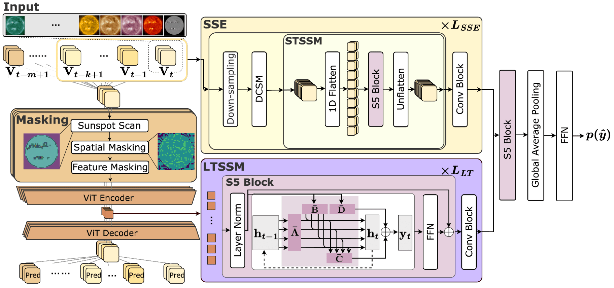
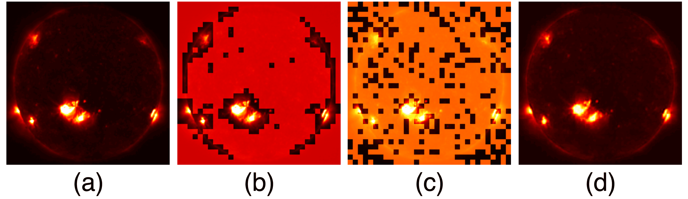
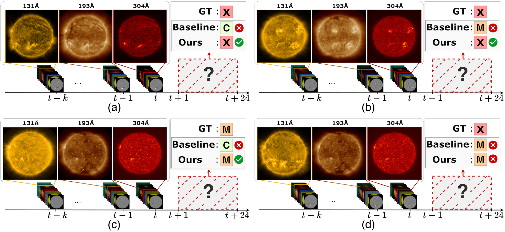

# [ICCV 25] Deep Space Weather Model: Long-Range Solar Flare Prediction from Multi-Wavelength Images 🛰️

[](https://iccv.thecvf.com/)
[](https://arxiv.org/abs/2508.07847)
[](https://keio-smilab25.github.io/DeepSWM)
[]()
[](https://pub-4f7db9ce770f41a091c81b96648d9afd.r2.dev/flarebench_dataset.tar.zst)

**Deep Space Weather Model (Deep SWM)** - accurately and reliably predicts solar flares by capturing long-range spatio-temporal dependencies and fine-grained features in multi-channel solar image series.

<p align="center">
  
</p>

## 📢 News

- **[2026-04]** 🎉 The full **FlareBench** dataset (~1.26 TB, covering the complete 11-year solar cycle) is now publicly available. See [📊 Data Preparation](#-data-preparation) for the download URL and usage notes.

## 📖 Abstract
<details>
  <summary><font size="+1">Click to expand</font></summary>
  <br>
  Accurate, reliable solar flare prediction is crucial for mitigating potential disruptions to critical infrastructure, while predicting solar flares remains a significant challenge. Existing methods based on heuristic physical features often lack representation learning from solar images. On the other hand, end-to-end learning approaches struggle to model long-range temporal dependencies in solar images.

In this study, we propose **Deep Space Weather Model (Deep SWM)**, which is based on multiple deep state space models for handling both ten-channel solar images and long-range spatio-temporal dependencies. Deep SWM also features a **sparse masked autoencoder**, a novel pretraining strategy that employs a two-phase masking approach to preserve crucial regions such as sunspots while compressing spatial information. Furthermore, we built **FlareBench**, a new public benchmark for solar flare prediction covering a full **11-year solar activity cycle**, to validate our method. Our method **outperformed baseline methods** and even **human expert performance** on standard metrics in terms of performance and reliability.
</details>

---

## ✨ Key Features

- **Solar Spatial Encoder (SSE)**: Captures spatio-temporal features by selectively weighting image channels and modeling dependencies across space and time.
- **Long-range Temporal SSM (LT-SSM)**: Extends deep state-space models to capture temporal patterns exceeding the solar rotation period.
- **Sparse MAE**: A tailored pretraining strategy for solar images that preserves critical but sparse regions (like sunspots) using a novel two-phase masking approach.
- **FlareBench Dataset**: A new public benchmark covering a complete 11-year solar cycle for robust and unbiased evaluation.

<p align="center">
  
  <em><br>Deep SWM Architecture: Solar Spatial Encoder (SSE) and Long-range Temporal SSM (LT-SSM)</em>
</p>

<p align="center">
  
  <em><br>Our Sparse MAE pre-training preserves critical sunspot regions better than standard methods.</em>
</p>

---

## 🏆 Results

Our model demonstrates state-of-the-art performance, outperforming existing methods and even human experts on the comprehensive FlareBench dataset.

<details>
  <summary><font size="+1">Quantitative Comparison</font></summary>
  <br>
  Our method achieves the highest scores across all standard evaluation metrics.
  <br>

| Method                            | Test Period                          | GMGS↑             | BSS<sub>≥M</sub>↑      | TSS<sub>≥M</sub>↑      |
| --------------------------------- | ------------------------------------ | ----------------- | -------------------- | ----------------- |
| Flare Transformer (w/o PF) [1]   | 2014-2017 (4 years)                  | 0.220±0.116       | -1.770±0.225         | 0.198±0.371       |
| DeFN-R [2]                       | 2014-2015 (2 years)                  | 0.302±0.055       | 0.036±0.982          | 0.279±0.162       |
| CNN-LSTM                          | 2019-12-01 - 2022-11-30 (3 years)    | 0.315±0.166       | 0.272±0.259          | 0.330±0.306       |
| DeFN [3]                         | 2014-2015 (2 years)                  | 0.375±0.141       | 0.022±0.782          | 0.413±0.150       |
| Flare Transformer (full) [1]     | 2014-2017 (4 years)                  | 0.503±0.059       | 0.082±0.974          | 0.530±0.112       |
| **Ours** | **2019-12-01 - 2022-11-30 (3 years)**| **0.582±0.032** | **0.334±0.299** | **0.543±0.074** |
| *Experts* | *2000-2015 (16 years)* | *0.48* | *0.16* | *0.50* |

</details>
<br>
<details>
  <summary><font size="+1">Qualitative Examples</font></summary>
  <br>
  Deep SWM successfully predicts high-impact X-class flares where baseline models fail.
  <p align="center">
    
  </p>
  <em>Qualitative results showing successful predictions of X-class and M-class solar flares.</em>
</details>

---

## 🛠️ Getting Started

### Installation

Clone the repository and set up the environment:

```bash
# Clone the repository
git clone https://github.com/username/DeepSWM.git
cd DeepSWM

# Install dependencies
pip install -r requirements.txt
```

### Usage

## 📊 Data Preparation

The full **FlareBench** dataset (approximately 1.26 TB, `tar` + `zstd` compressed) is available for academic use at the following URL:

```
https://pub-4f7db9ce770f41a091c81b96648d9afd.r2.dev/flarebench_dataset.tar.zst
```

The archive contains the raw `aia/`, `hmi/`, and `xrs/` directories. After downloading, extract it with

```bash
tar --zstd -xf flarebench_dataset.tar.zst
```

Then build the hourly HDF5 datasets with `ml/src/data/create_datasets.py`. The script expects `aia/` and `hmi/` to be located directly under `--data_root`, while `xrs/` is expected to reside in the parent directory of `--data_root` (see the path construction in the script). Please arrange the extracted directories accordingly before running the script.

The dataset is provided **for academic use only**. Please do not redistribute it.

## 🚀 Pre-training

Run the pre-training process to learn representations from the magnetogram images:

```bash
cd ml
python pretrain.py --input_dir ../flarebench_dataset/all_data_hours \
                  --output_dir ../flarebench_dataset/all_features \
                  --mode train \
                  --data_root ../flarebench_dataset
```

## 🔍 Feature Extraction

Extract intermediate features from the pre-trained model:

```bash
cd ml
python pretrain.py --input_dir ../flarebench_dataset/all_data_hours \
                  --output_dir ../flarebench_dataset/all_features \
                  --mode inference_all \
                  --data_root ../flarebench_dataset
```

Organize the extracted features by sample:

```bash
cd ml
python src/features/create_history_features.py
```

## 🎯 Training

Train the model using the extracted features:

```bash
cd ml
python main.py --params params/main/params.yaml \
              --imbalance \
              --fold 3 \
              --data_root ../flarebench_dataset \
              --cuda_device 0

```

## 📚 References

[1] Kanta Kaneda et al. Flare transformer: Solar flare prediction using magnetograms and sunspot physical features. In ACCV, pages 1488–1503, 2022.

[2] Naoto Nishizuka, Yuki Kubo, et al. Reliable probability forecast of solar flares: Deep flare net-reliable (defn-r). The Astrophysical Journal, 899(2):150, 2020.

[3] N. Nishizuka, K. Sugiura, Y. Kubo, M. Den, and M. Ishii. Deep flare net (defn) model for solar flare prediction. The Astrophysical Journal, 858(2):113, 2018.


## 📝 Citation

If you find our work helpful, please consider citing the following paper and/or ⭐ the repo:

```bibtex
@inproceedings{nagashima2025deepswm,
  title={Deep Space Weather Model: Long-Range Solar Flare Prediction from Multi-Wavelength Images},
  author={Shunya Nagashima and Komei Sugiura},
  booktitle={Proceedings of the IEEE/CVF International Conference on Computer Vision},
  year={2025}
}
```

## 📄 License

This work is licensed under the BSD-3-Clause-Clear License. To view a copy of this license, see [LICENSE](LICENSE).
